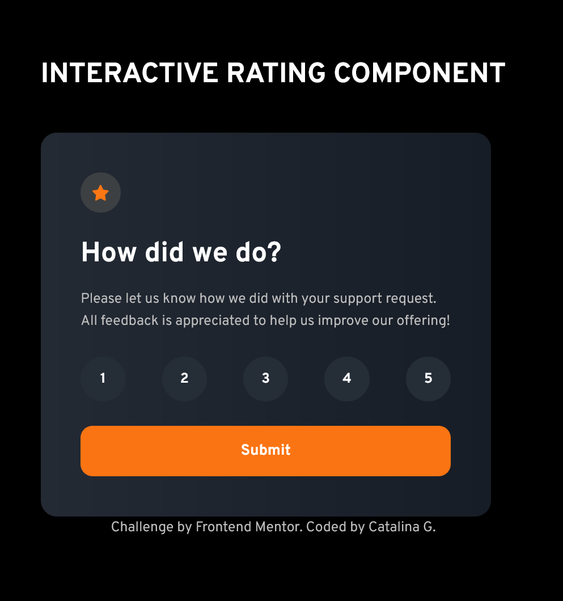

# Frontend Mentor - Interactive rating component solution

### Screenshot

### Links

- Solution URL: [Add solution URL here](https://github.com/cgojk/interactive_rating.git)
- Live Site URL: [Add live site URL here](https://frolicking-brioche-7d335b.netlify.app/)

## My process

### Built with

- Semantic HTML5 markup
- CSS custom properties
- Mobile-first workflow

### What I learned

## Author

Catalina G
